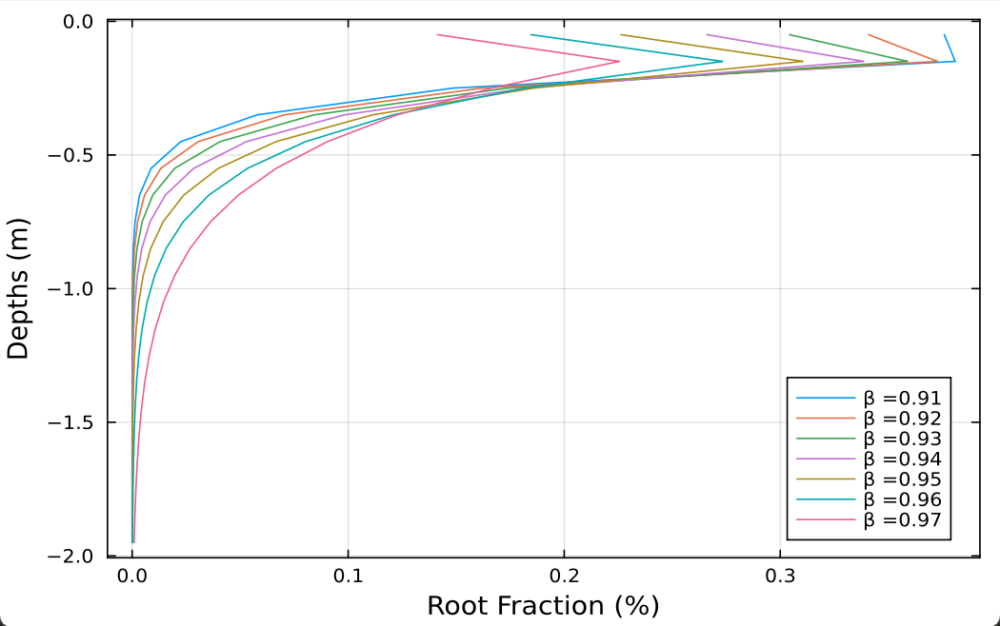
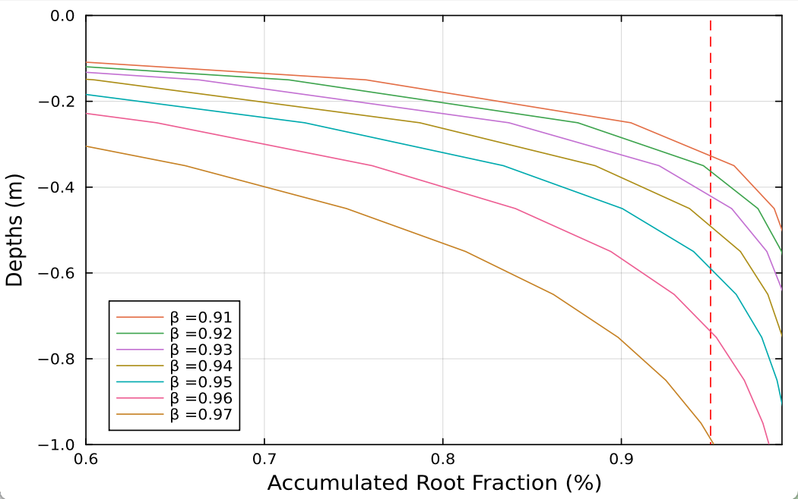

# SoilDiffEqs

<!--  -->

> 求解土壤水运动方程

- [x] `Bonan 2021`：计算速度快，但公式复杂
- [x] `diffeq`: 公式清晰，但计算速度过慢

## 求解方案
> 两类边界条件的求解
- [x] `Q0`：已知下渗流量
- [x] `ψ0`：已知地表水势

> 注意，sink需要划分到每一层的蒸发量

## 根系

## References

<!-- - <https://github.com/jl-pkgs/HydroTools.jl/blob/master/src/Soil/soil_moisture.jl> -->

- <https://github.com/amireson/RichardsEquation/blob/master/Richards%20Equation.ipynb>

## TODO

- [ ] 考虑地下水影响的求解方案

1. <https://github.com/NCAR/noahmp/blob/master/src/GroundWaterTopModelMod.F90>
2. <https://github.com/CoLM-SYSU/CoLM202X/blob/master/main/HYDRO/MOD_Hydro_SoilWater.F90>

## 测试站点

<https://mesonet.agron.iastate.edu/agclimate/hist/hourly.php>
